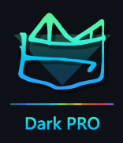

# Dark PRO Color Schemes
<!-- Improved compatibility of back to top link: See: https://github.com/othneildrew/Best-README-Template/pull/73 -->

<!-- PROJECT LOGO -->
 

  

  <h3 align="center">Dark PRO</h3>

  

    A professional Sublime Text color schemes collection.
  

<!-- TABLE OF CONTENTS -->

  
Table of Contents

  <ol>
    <li><a href="#about-the-project">About Dark PRO</a></li>
    <li><a href="#features">Features</a></li>
    <li><a href="#screenshots">Screenshots</a></li>
    <li><a href="#installation">Installation</a></li>
    <li><a href="#license">License</a></li>
    <li><a href="#contact">Contact</a></li>
  </ol>

<!-- ABOUT THE PROJECT -->
## About The Project
Color schemes (<a href="https://github.com/draganmilenkovic/DarkPRO">Dark PRO Original, PRO Blue Neo-Zen (New), PRO Blue Zen (New), Dark PRO Bright, Dark PRO Volatile Black, PRO Blue Original, PRO Blue Deep, PRO Blue X-Deep</a>) for Sublime Text.

<!-- FEATURES -->
## Features:

Dark PRO themes strike the center of beautiful colors and eye-care, creating a perfect dark themes selection for your next 20.000 hours in front of the screen.
* Built by a Monokai scheme fan and battle-tested Graphic Design & Coding PRO
* Built with goal to create the perfect balance between vivid colors and eye-care.
* Instantly elevates your code highlighting.
* Specific targeting for several coding languages.

(<a href="#readme-top">back to top</a>)

<!-- SCREENSHOTS -->
## Screenshots

#### JS - Dark PRO Original

#### CSS - Multi

#### JS - Dark PRO Volatile Black

#### JS - Dark PRO Bright

#### JS - Dark PRO Blue

#### JS - Dark PRO Blue Deep

#### JS - Dark PRO Blue X-Deep

#### PHP - Dark PRO Volatile Black

#### PHP - Dark PRO Original

#### PHP - Dark PRO Bright

#### PHP - Dark PRO Blue

#### PHP - Dark PRO Blue Deep

#### PHP - Dark PRO Blue X-Deep

#### HTML - Dark PRO Volatile Black

#### HTML - Dark PRO Original

#### HTML - Dark PRO Bright

#### HTML - Dark PRO Blue

#### HTML - Dark PRO Blue Deep

#### HTML - Dark PRO Blue X-Deep

(<a href="#readme-top">back to top</a>)

<!-- INSTALLATION -->
## Installation

##### via Package Control
* Make sure you already have Package Control installed
* Open the Command Palette (Ctrl+Shift+P on Windows/Linux, ⇧⌘P on iOS) and choose "Install Package" from the list
* When packages load, type "DarkPRO" (or just Dark PRO... until Dark PRO Color Schemes appears) and press Enter
* Open the Command Palette again, or if it's already open, proceed
* Then you can start typing "color" and select the "UI: Select Color Scheme" option when it appears on the list.
* Now choose any Dark PRO scheme you like from the selection.
* (you can also go to `Preferences > Color Schemes > Dark Pro Color Schemes` and select a scheme)

##### Manual Installation
* Download a .sublime-color-scheme file
* Browse Packages from the Command Palette (Ctrl+Shift+P on Windows/Linux, ⇧⌘P on OS X)
* Copy the .sublime-color-scheme file to Packages
* And add the following line to Settings - User (Preferences.sublime-settings) file.

`"color_scheme": "Packages/[RootOrYourCustomRoot]/Dark PRO Original.sublime-color-scheme"`

(<a href="#readme-top">back to top</a>)

<!-- LICENSE -->
## License

Distributed under the MIT License. See `LICENSE.txt` for more information.

<!-- PROJECT LINK -->
## Contact

Project Link: [https://github.com/draganmilenkovic/DarkPRO](https://github.com/draganmilenkovic/DarkPRO)

(<a href="#readme-top">back to top</a>)
